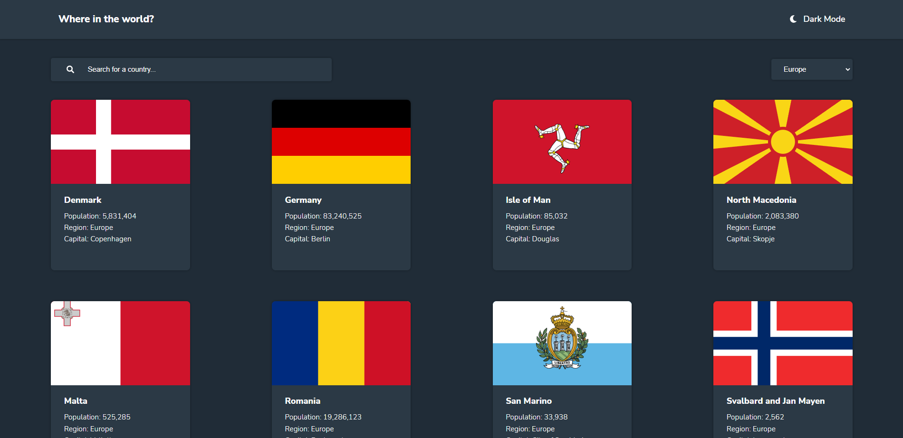

# REST Countries API with color theme switcher

### The challenge

#### Users are able to:

* See all countries from the API on the homepage
* Search for a country using an input field
* Filter countries by region
* Click on a country to see more detailed information on a separate page
* Click through to the border countries on the detail page
* Toggle the color scheme between light and dark mod

## Built with :cowboy_hat_face:	
- HTML5
- CSS
- Flexbox
- CSS Grid
- SASS (SCSS)
- JavaScript
- Vue 3

## Live Demo
Link for live demo<a href="https://celadon-pika-5cb5e6.netlify.app/"> click here. </a> :point_left:
